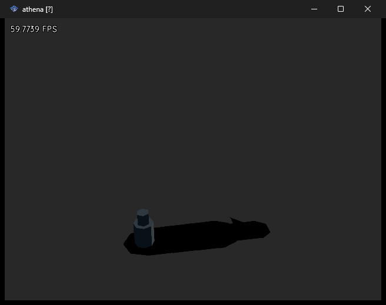

# Hardware notes

What generated output actually does when it runs, as opposed to what the unit tests say it
should emit. Roadmap item 6.

Everything here was observed on an emulator. **Nothing in this file has been run on a real
PlayStation 2 yet.**

The August shadow calibration tables below are historical. The September fix replaces
the property-setter compensations with a direct `setTransform` matrix; those tables no
longer describe the generator. See [verification](VERIFICATION.md) for the current checks.

---

## 2026-10-01 — side-scroller jump

The release ELF returns numeric native geom IDs in contact callbacks, unlike the
JS geom objects returned by the source binding. Before the fix, a Cross press at
frame 90 was detected but `ctx.player.grounded` stayed false and the player's centre
remained at y=0.496341. `_name` and `_ctxKey` cannot be read from numeric IDs.

The generator now detects that callback shape and polls known event pairs with
`ODE.geomCollide` before subsequent physics steps. This query creates no contact
joints; the broad phase and solver still run once. Newer object callbacks retain
their existing path without extra queries. The side-scroller ground also enables
accurate clipping so its large triangles remain visible near the camera.

Verified in PCSX2 using `../.verification/jump-probe.js`: jump from ground,
reject another press in air, land, jump again, and jump from Platform1. Immediately
after each accepted jump, vertical velocity is 6.34304 (6.5 minus one gravity step).
The probe and assertions passed; records are in
[`../.verification/jump-runtime.log`](../.verification/jump-runtime.log).
The rebuilt editor also passed all 456 automated tests.

---

## 2026-10-01 — momentum controller

The side-scroller now ships a momentum controller with progressive sprint, skids,
rolling and charged launches, variable jump height, coyote time and jump buffering,
shoulder dash, ground pound and camera look-ahead. Animation data is exposed through
`ctx.player.motion`, `speedTier`, velocities and one-frame `events`; playback waits
for the user's model and clips. See [controls](SIDESCROLLER-CONTROLS.md).

`../.verification/momentum-probe.js` runs 1,030 frames of scripted pad input against
the generated project in PCSX2. All assertions passed: gradual acceleration,
three sprint stages (8.9952, 11.9952 and 15.9952 after solver friction), coasting,
skidding, rolling, charging and launching (16.9952), long/short jumps, ground pound,
landing recovery, a single air dash before landing and jumping from a platform.
Records are in [`../.verification/momentum-runtime.log`](../.verification/momentum-runtime.log).
The rebuilt editor passed all 478 tests, including 12 controller behavior tests.

Two runtime details affected the tuning. Soft support contacts and small solver
bounces require brief support grace, with deliberate jumps clearing that grace.
Ground-pound recovery cancels upward solver velocity to prevent the hardcoded
contact bounce from relaunching the player. Contact positions distinguish support
below the body from ceiling contact.

Athena's custom float32 values also expose a comparison defect: the mixed
float32/float64 branch in `quickjs.c`'s `js_relational_slow` (`float64_compare`) reads
a float32 operand as integer bits. Arithmetic in `js_add_slow` can produce float32
even from double operands. This made sprint timers reach stages too early and the
approach function exceed its target. The controller normalizes body velocities,
approach operands and accumulated sprint time through a reused Float64Array before
comparison. The probe now asserts the early stage limits as well as the final speed.

---

## The setup

| | |
|---|---|
| Emulator | PCSX2 2.6.3, Vulkan renderer |
| BIOS | SCPH-39001 (USA v1.60) |
| Engine | `athena.elf`, 5 458 324 bytes, CRC `BB150F8A` (`reference/AthenaEnvReleaseAndExamples/`) |
| Required setting | `HostFs = true` in `PCSX2.ini` |
| Boot | `pcsx2-qt.exe -batch -fastboot -logfile <log> -- <folder>\athena.elf` |

PCSX2 sets the `host:` root to **the booted ELF's own directory**, so a project folder on
the PC works unchanged: `main.js`, `scripts/` and the asset folders are read straight off
disk, exactly as `planScaffold` lays them out.

Run it with:

```bash
deno task ps2run
```

---

## Four things about the toolchain that are not obvious

### `console.log` does not reach the PCSX2 log

`console.log` is quickjs's `js_print` writing to stdout (`quickjs-libc.c:3476`). Nothing
captures that on the PS2 side, and `-logfile` holds EE/IOP kernel output only. A run
instrumented entirely with `console.log` produces a log with no trace of it whatsoever.

**HostFS writes do work**, though — verified by having a program call
`std.open("probe.log", "w")` and reading the file back from Windows. That is the channel
`tools/ps2run.js` uses: the program writes `probe.log` into its own folder and the harness
reads it as an ordinary file.

### A project folder path over 135 characters fails silently

The same `athena.elf`, `athena.ini` and `main.js` render from a 135-character folder and
show **a black screen** from a 136-character one. Measured by bisection, one character at a
time, holding everything else identical:

| Folder path length | Result |
|---|---|
| 7, 64, 96, 112, 120, 128, 130, 132, 133, 134, 135 | renders |
| 136, 137, 139 | black |

It is the *boot directory* that is limited, not each file: from a short folder, an asset at
a 150-character full path opens fine. This matches the cwd AthenaEnv reads with `getcwd()`
into `boot_path`, a `char[255]` at `main.c:43` — though 135 is measured, not derived, so
treat it as a property of this PCSX2 version rather than a constant of the engine.

There is **no diagnostic of any kind**: no log line, no error screen, just black. Two hours
of this investigation went into chasing a "bug" that was only ever the Windows temp
directory being 139 characters deep. `tools/ps2run.js` refuses to stage into an over-long
path for that reason, and `tests/ps2run_test.js` pins both sides of the boundary.

### Screenshots need `PrintWindow`, not the screen

PCSX2 renders into a second top-level window, titled after the running program; the window
titled `PCSX2 …` keeps showing the game list. Capturing it:

- **`PrintWindow(hwnd, dc, PW_RENDERFULLCONTENT)` works**, including on the Vulkan surface,
  with the window occluded and unfocused. This is what `tools/ps2capture.ps1` uses.
- PCSX2's own F8 screenshot needs the render window focused, and `SetForegroundWindow` is
  refused to a background process, so the keystroke never arrives and `snaps\` stays empty.
- Forcing it with `-fullscreen` plus minimise/restore *does* take focus, but it hijacks the
  desktop and PCSX2 stops presenting once the window is minimised.

### PCSX2 is single-instance, and a stray one poisons every later run

Launching PCSX2 while another copy is running does not start a second emulator: the new
process hands off to the existing one and exits immediately. The harness then sees a
process that has already exited, finds no render window, and reports the case as having
drawn nothing — which looks exactly like a rendering bug. An interrupted run leaves such a
process behind, so one cancelled matrix silently corrupts every run after it.
`tools/ps2capture.ps1` clears strays before launching.

### Do the pixel work in compiled code, not in PowerShell

The frame analysis started life as PowerShell loops: about a million iterations per frame,
**20 seconds each**, which across the matrix was most of the wall time. The same arithmetic
compiled through `Add-Type` runs in **0.77 seconds** — a 26x difference, with identical
numbers. `tools/ps2measure.ps1` keeps every per-pixel loop inside its C# block; if you
extend it, add to the C# rather than adding a PowerShell loop beside it.

What is left is dominated by the emulator boot, about 14 seconds a case. Only batching
several cases into one boot can cut that. `--batch-alpha` does it for the opacity sweep —
five levels in one frame, 17 seconds against 75 — but it places its sample boxes from
geometry rather than locating each decal, and disagrees with the serial sweep by up to 30
points at the extremes. It is labelled experimental, prints its own disagreement, and
deliberately reports no verdict. **The serial path is the authority.**

---

## 2026-08-04 — regression pass on the four fixed defects

`state.md` listed four defects found on 2026-08-02, all fixed afterwards and **none of them
ever re-run**. This pass ran the fixed code.

Fixture: `regressionProject()` in `tools/ps2run.js`. Camera at `(0, 7, 9)` aimed at
`(2, 1, -3)`, a directional light at `(1, 0.6, 0)`, the asymmetric `player.obj` placeholder
as the caster, `ground.obj` underneath, and `Probe.js` attached as a behaviour script.



59.8 FPS, 640×448 NTSC. The mesh renders, the shadow lands at its feet and stretches along
the light's axis.

| Defect | Verdict | Evidence |
|---|---|---|
| `Camera.target()` drags the camera | **Fixed, confirmed** | `Camera.save()` reads back `pos (0, 7, 9)`, `tgt (2, 1, -3)` — exactly what the scene emitted |
| `new Font("consola.TTF")` kills a fresh project | **Fixed, confirmed** | The fixture has no `fonts/` dir; codegen emits `new Font("default")` and the program boots and draws its FPS counter |
| Shadow rotated | **Consistent, not proven** | The decal lies along the light's azimuth and is foreshortened. One light angle only — see below |
| Shadow wrong size | **Consistent, not proven** | Extent looks right against the mesh, but nothing measures it |

### What the camera check actually proves

`Camera.target()` moves the camera by the **delta** from the previous target, and the
engine starts at `(0, 0, 0)`. A scene that aims at the origin therefore produces a zero
delta, and the wrong call order reads back identically to the right one. The first version
of this fixture aimed at the origin and passed vacuously. The target is `(2, 1, -3)` now
precisely so the check can fail.

That it *can* fail was then verified rather than assumed. `deno task ps2run --sabotage`
re-emits `Camera.position()` before `Camera.target()` and the run goes red:

```
FAIL  camera   camera position is (2, 8, 6), expected (0, 7, 9) (off by 3.0000)
```

`(2, 8, 6)` is `(0, 7, 9)` displaced by exactly the target delta `(2, 1, -3)`, which is the
engine's documented behaviour reproducing itself on demand.

### Still unverified

This pass was regression-only. Untouched, and still verified against the C sources alone:
**real hardware, scene transitions, animation, triggers, sound, the HUD, blob shadows and
draping**, plus four of the five rigidbody shapes. Roadmap item 6 stays open.

The two shadow verdicts above turned out to be wrong, which is what the next section is
about: a single light angle cannot distinguish a correctly turned decal from a
coincidentally plausible one, and this one was coincidental.

---

## 2026-08-04 — shadow projector, measured across the circle

`deno task ps2shadow` runs a twelve-case matrix and measures the decal in pixels rather
than looking at it. The scene exists to make that measurement sound: a fixed near-top-down
camera so world +X is screen right and +Z is screen down, a 60×60 ground so
`Screen.clear`'s dark grey never reaches the frame, a nearly opaque decal, and ambient
raised until the frame holds exactly three luma populations — **0 for the decal, 40 for the
ground, 104 for the caster**. Scale is calibrated from the run itself by moving the caster
a known 4 units and watching it move: **43.9 px/unit in X, 48.0 px/unit in Z**.

Two measurement traps, both of which produced confident nonsense before being fixed:

- The window frame around the client area is near-black, about 12 000 pixels, comparable to
  the decal itself, and being fixed in place it drags every centroid toward frame centre.
  It is cropped out now.
- Calibrating from the *shadow* laundered a broken decal into a plausible number. The scale
  comes from the caster, which is a known object at a known world position.

### What it found: the decal was mirrored in X

Shadow direction in world degrees, `atan2(z, x)`, caster at the origin, light elevation 31°:

| Light azimuth | Observed | If `direction` points at the light | If it is the travel direction | Correct, mirrored in X |
|---|---|---|---|---|
| 0 | 4 | −180 (off 176) | 0 (off 4) | 0 (off 4) |
| 45 | −20 | −135 (off 115) | 45 (off 65) | −45 (off 25) |
| 90 | −90 | −90 (**off 0**) | 90 (off 180) | −90 (**off 0**) |
| 135 | −159 | −45 (off 114) | 135 (off 66) | −135 (off 24) |
| 180 | 177 | 0 (off 177) | −180 (off 3) | −180 (off 3) |
| 225 | 152 | 45 (off 107) | −135 (off 73) | 135 (off 17) |
| 270 | 90 | 90 (**off 0**) | −90 (off 180) | 90 (**off 0**) |
| 315 | 29 | 135 (off 106) | −45 (off 74) | 45 (off 16) |
| **mean error** | | **99°** | **81°** | **11°** |

Neither light-direction convention explains it. What does is that the decal lands in the
right place **with its X component negated** — exact for the pure ±Z lights, 3–4° for the
pure ±X lights, and 16–25° at the diagonals, where the blob's centroid is not the decal's
centre because a mis-rotated rectangular decal skews it.

The practical shape of the bug: **a light with any X component throws the shadow to the
wrong side.** With the light on +X the shadow falls on +X, alongside it. Lights straight
along ±Z happen to look right, because negating a zero changes nothing — which is exactly
why the single-angle check in the previous section passed.

This is not a disagreement between the editor's arithmetic and the engine's. Running
`shadowProjection()` over all eight azimuths and applying the engine's own `(R·S)` by hand
gives the **correct** direction every time; `vu0_matrix_apply` (`matrix.c:420`) is confirmed
row-vector, as `src/core/shadowmath.js` assumes. So the mismatch is between that model and
what the hardware does with the same numbers, and it is concentrated in the cases where the
decal rotation is actually active: at azimuth 90/270 the emitted `quatY` is 0 and the decal
is correct; at 0/180 `quatY` is ∓0.7071 and it is backwards. The suspect is the handedness
of the quaternion the engine builds in `shadow_create_transform_matrix` (`shadows.c:10`)
against the pre-rotation of `.position` in `shadowPositionFor`.

### What it found: the decal did not follow the caster

| Case | Caster | Decal |
|---|---|---|
| caster to (4, 0.5, 0) | moved +176 px, as calibrated | moved **−330 px** — wrong direction, wrong distance |
| caster to (0, 0.5, 4) | moved +192 px, as calibrated | **vanished** — not one dark pixel in the frame |

The disappearance is the more alarming of the two: the program keeps running at 54 FPS and
draws nothing where the shadow should be, with no error anywhere.

### What it found: the decal was far too big

`setSize(2.0, 3.887)` while the shadow that should have been drawn was 0.6 x 1.94 world
units. The decal came out **2.2x** its due size, uniformly - the aspect ratio was preserved
across all eight azimuths - and the same factor scaled its position, which is why the
shadow also sat too far from the caster.

Two things this section originally blamed turned out to be wrong, and are corrected in
"Still open" below: auto-fit's bounding-sphere margin is about 24%, not 2.4x, and its
fallback to the manual extent does emit a diagnostic. **The outline was the 2.2x
inflation**, and nothing else.

### The fixes

**One: the rotation sense.** The emitted `quatY` is negated. Reading the sources predicts
the opposite: the chain is `T . (R . S)` (shadows.c:58-60), a row-major `A . B`
(matrix.c:334) and a row-vector apply (matrix.c:420), and together they turn the decal by
+phi. The hardware turns it by -phi. Across the eight azimuths a +phi model is 99 degrees
off on average and -phi is 11.

**Two: the decal was inflated.** `1/r` should cancel the quaternion's `sqrt(1 + 4y^4)`
inflation exactly. On hardware it does not, and the decal comes out too big by a factor
that grows with the turn. `.scale` was confirmed live first - halving the emitted value
halved the blob exactly, 195x62 px to 97x31 px, and it drives size and position together,
so one factor corrects both:

| \|phi\| | 0 | 45 | 90 |
|---|---|---|---|
| decal too big by | 1.00 | 1.70 | 2.17 |
| `1 + \|sin phi\|` | 1.00 | 1.71 | 2.00 |

`scaleXZ` is now `1 / (r * (1 + |sin phi|))`. That term is a **fit to three points, not a
derivation**.

**Three, and this one was mine.** `major`/`minor` come from second moments, which describe
how a blob's mass is spread rather than how far it reaches, so blobs of equal length but
different shape scored differently. Every size check read "0.5x narrower" while the shadow
was in fact correct. The judge uses axis-projected extents now.

Two earlier findings were also mine rather than the engine's. The **vanishing shadow** was
the test: moving the caster 4 units pushed the decal off the frame, and at 2 units it is
there and correct. The **"1.9x too long"** verdict came from comparing against
`width * stretch`, which double-counts a foreshortening already inside `sizeZ`.

### Result: the whole matrix passes

| Check | Originally | Now |
|---|---|---|
| direction, 8 azimuths | 6 wrong | **8 pass** |
| decal turns with the light | 4 wrong | **8 pass** |
| size, all azimuths | wrong | **11 pass** |
| follow, X and Z | wrong direction and gain | **2 pass** (91 px against 88 due, 99 against 94) |
| caster rotated | dominated by the placement bug | **passes** |
| light direction vs lit side | inconclusive | **passes** |
| **total** | **18 failing, 1 inconclusive** | **0 failing, 0 inconclusive** |

### The light direction, settled

The convention-free test finally works. A **sphere** replaces the flat-shaded prism: the lit
side of a curved caster is brighter, so it pulls the luma-weighted centroid toward the
light, and that needs no brightness threshold to read. Ambient down and diffuse up gives a
20% spread between the sphere's two sides, against the 1% the prism managed.

With `direction` set to `(1, 0.6, 0)`:

- the light lands on the **+X** side of the sphere (weighted centre 1.0 px off centre),
- the shadow falls on **-X** (75 px off centre).

Opposite sides, read off one frame. So `Lights.DIRECTION` **does point toward the light**,
exactly as `core/components.js` says it does, and the shadow correctly falls away from it.
Both halves of the engine agree, and so does the editor.

### Still open

**Auto-fit's margin.** `autoFit` sizes the decal from `radius * 2.12`, where `radius` is the
half-diagonal of the caster's bounding box. An earlier revision of this file called that a
2.4x over-cover by comparing it against the caster's *width* — that was wrong. The
silhouette camera looks along the light, so at a 31 degree elevation the silhouette is
dominated by the caster's **height**, not its width, and a decal wider than the mesh is
correct. Against the tight bound — the AABB's largest extent perpendicular to the light —
the bounding sphere over-covers by about 24%, which is a reasonable safety margin rather
than a defect. **The outline the shadows used to show was the 2.2x inflation, now fixed.**

When the caster's mesh bounds are unavailable — any headless run, or a mesh not yet loaded
in the editor — auto-fit falls back to the manual `size.x` and emits an info diagnostic
saying so. An earlier revision called that silent; it is not. `tools/ps2run.js` was
filtering diagnostics to errors only and hid it.

---

## 2026-08-06 — alpha blending: PABE

The shadow could only ever be invisible or solid black. Measured, it was not the blend
equation, not the blend mode, and not the projector: **the editor was switching alpha
blending off for every project it exported.**

### What it looked like

Sweeping the decal's colour alpha, sampling the decal's core against the lit ground:

| alpha | 0.00 | 0.25 | 0.50 | 0.75 | 1.00 |
|---|---|---|---|---|---|
| SHADOW_BLEND_DARKEN | invisible | invisible | **black** | black | black |
| SHADOW_BLEND_ALPHA | invisible | invisible | **black** | black | black |
| ALPHA, alpha test ref 0 | black | black | black | black | black |

The third row is the one that rules out the obvious explanation: with the alpha test out of
the way the decal is opaque at **every** alpha, including 0.10. Both blend modes behaved
identically, and the two cases were checked to have emitted genuinely different
`setBlend` calls, so the mode reached the engine and changed nothing.

### The cause

`Screen.setParam(PIXEL_ALPHA_BLEND_ENABLE, …)` does not enable alpha blending. It writes
the GS **PABE** register (`graphics.c:479`), which ps2sdk defines as `GS_REG_PABE 0x49`,
"Alpha blending control in units of pixels". Its meaning is the opposite of what the name
suggests:

- **PABE 0** — blending follows the primitive's ABE bit, ie normal alpha blending.
- **PABE 1** — blending happens **only where the source alpha's MSB is set**.

PS2 alpha stores 128 as fully opaque, so with PABE on the only alpha that blends is the one
that needed no blending; everything translucent is written straight through. Codegen emitted
`PIXEL_ALPHA_BLEND_ENABLE, true` for every project, so **nothing anywhere could be
translucent** — not shadows, not the HUD, not blended materials.

The two other suspects are ruled out by the sources: ABE is on by default
(`gsGlobal->PrimAlphaEnable`, `render.c:383`), and the texture function is
`COLOR_MODULATE` throughout `render.c`, so vertex alpha is modulated rather than replaced.

### With PABE off

| alpha | 0.10 | 0.25 | 0.50 | 0.75 | 1.00 |
|---|---|---|---|---|---|
| darkening | 10% | 25% | 50% | 75% | 100% |

Linear, 1:1. `display.alphaTest.pixelBlend` is `false` by default now, migration forces it
off for existing projects — none of them chose it deliberately — and `validateScene` warns
with a one-click fix if it is turned back on. `tests/pabe_test.js` pins all of it.

### The second gate

`display.alphaTest.ref` defaults to 50 with `ALPHA_GREATER` and `ALPHA_FAIL_NO_UPDATE`, so
fragments at or below alpha 50 of 128 (about 0.39) are discarded **before** blending. That
is why the first two rows above still read "invisible" at alpha 0.25 even after the fix. It
is left at 50: discarding nearly-invisible fragments is a real fill-rate saving on this
hardware, and it is a project setting the user can lower.

### The colour route, which also works

Independently of alpha, the decal's colour drives its darkness: measured `luma = grey × 128`,
the PS2's 0..128 colour scale. On a ground of luma 40 the decal matches the ground at grey
0.32, so that is the ceiling — above it the "shadow" paints lighter than what it sits on and
reads as a glow. Useful when a flat tint is wanted rather than true translucency.

### What this does not say

Every number here is PCSX2 2.6.3, not a console. The two corrections in
`src/core/shadowmath.js` are **measured, not derived**: the C sources predict a different
sign and a different magnitude, and nothing found in them explains the difference. They are
pinned by `deno task ps2shadow` across twelve cases and by `tests/ps2shadow_test.js`, so a
future "simplification" back to what the sources imply will fail loudly — but the underlying
reason is still unknown, and the prime suspect remains that `.rotation` never writes `w`
(`ath_shadows.c:153-155`).

---

## 2026-08-07 — the decal follows the caster, but only at the cardinal azimuths

Reported from a real project: *"the shadow does not follow me correctly. It moves, but not
in the same direction as my character — I end up in one place and the shadow somewhere
else."* The light in that project was `(0.4, 1, 0.6)`.

The whole shadow matrix was green at the time, and it stayed green while the defect was
reproduced. That is the interesting part.

### Why twelve passing cases could not see it

The decal's `position` rides through the same rotation as its grid — `world = (local +
position) . R . S` — so the generator pre-rotates it by `R⁻¹`. Two things have to be true
for that to cancel: the engine's turn has to be the angle we asked for, and the caster has
to be somewhere the turn can move it.

The matrix broke both:

- `movedX` / `movedZ` move the caster, but at azimuth 0, where `phi` is −90° and the
  pre-rotation degenerates into an axis swap.
- The eight azimuth cases turn the light, but with the caster **at the origin**, where
  rotating (0, 0) gives (0, 0) whatever the angle.

So the pre-rotation was only ever exercised where it could not fail. `az45movedX` and its
siblings — a moved caster under a turned light — fail immediately:

| case | caster moved | decal moved | error |
|---|---|---|---|
| `az45movedX` | (168, −1) px | (168, −48) px | 48 px across |
| `az45movedZ` | (−1, 179) px | (73, 167) px | 73 px across |
| `az225movedX` | (167, 1) px | (133, −67) px | 76 px |

The decal's bounding box translated **rigidly** and kept its size, so this is not the caster
occluding it: the decal genuinely moves along a different vector than the thing casting it.

### The engine overshoots a turn, and the overshoot vanishes at both ends

Reading the decal's long axis off the frame at ten azimuths, against the axis the light
implies:

| phi (asked) | 0 | ±22.5 | ±45 | ±67.5 | ±90 |
|---|---|---|---|---|---|
| overshoot | 0.1° | 15.4° | 17.6° | 9.8° | 1.5° |

Exact at 0 and ±90, worst in the middle. Every azimuth the matrix used sat at one end or the
other, and the `azimuth` check's tolerance was 20°, so a decal turned 19° off the light
passed. Both facts had to hold for this to survive as long as it did; the tolerance is 8°
now.

`SHADOW_TURN_TABLE` in `src/core/shadowmath.js` inverts the relation, so the generator asks
for the turn that *lands* on `phi` rather than for `phi` itself. Re-measured across the same
ten azimuths:

| | before | after |
|---|---|---|
| mean orientation error | 9.5° | **1.4°** |
| worst orientation error | 19.2° | **3.1°** |

and every follow case now tracks the caster, at every azimuth tested (0, ±22.5, ±45, ±67.5,
±90, plus the folded pair at 225 and 315).

### And the magnification was wrong in exactly the same way

With the turn fixed, the decal still came out 10–15% **too small** at intermediate azimuths,
and travelled correspondingly less than the caster. Same cause, one level down: the
`1 + |sin phi|` inflation fit had been taken at 0, 45 and 90 — three points, two of them at
the ends where the decal is not turned at all.

The first attempt to refit it from the blob's own extent went nowhere, and it is worth
recording why. The decal's apparent size on screen is not a clean signal: the caster stands
on the near end of its own shadow and eats part of it, and how much it eats depends on the
azimuth. Measured that way the decal looked 40% small at ±22.5° and correct at ±67.5°, which
is not a shape any transform produces.

**The position is the honest measurement.** `world = (local + position) . R . S`, so the
decal's centre rides the same factor as its geometry — and the distance the decal *travels*
when the caster moves is immune to occlusion, because the occlusion is identical at both
ends of the move. The decal's bounding box translates rigidly, so the translation can be
read straight off it:

| \|phi\| | 0 | 22.5 | 45 | 67.5 | 90 |
|---|---|---|---|---|---|
| decal travel ÷ caster travel | 1.000 | 0.845 | 0.871 | 0.891 | 1.037 |
| total magnification the engine applies | 1.000 | 1.041 | 1.303 | 1.695 | 2.933 |

The second row is the first solved back through `scaleXZ`, and it is what
`SHADOW_MAGNIFY_TABLE` holds. `scaleXZ` is now simply 1/that — it subsumes the quaternion's
own `r` as well, so there is one measured factor instead of a derived one multiplied by a
fitted one.

Note the 1.000 at phi = 0 is not measured but structural: with no turn the quaternion is
identity, `scaleXZ` is 1, and the transform passes the position through untouched.

The screen rig's own anisotropy — 84.02 px/unit in X against 90.57 in Z, from the perspective
camera — does not contaminate this, because both the decal and the caster are measured
travelling the *same* world vector through the *same* screen.

### Where it ended up

Re-run from scratch with both tables in place: **0 failing, 0 inconclusive** across the whole
matrix — ten azimuths, caster moves at six of them, a caster rotation, the lit-side check and
five opacity families. The follow cases now track the caster to within a few pixels:

…and then a second calibration pass, because one pass cannot tell a correction from the noise
it was fitted through. Measuring what was LEFT over after the first table gave residuals of
1.019, 1.022 and **1.096** — so 22.5 and 45 were nearly right and 67.5 was 10% short. That
entry was the one resting on a single reading, which is why `az22movedZ` was added: every
`|phi|` now has at least two independent readings.

Multiplying the table through by those residuals and re-measuring:

| \|phi\| | readings (decal travel ÷ caster travel) | mean | off by |
|---|---|---|---|
| 22.5° | 0.986, 1.000 | 0.993 | −0.7% |
| 45° | 0.994, 0.992, 1.002, 1.008 | 0.999 | −0.1% |
| 67.5° | 0.996, 1.001 | 0.998 | −0.2% |
| 90° | 1.000, 0.999 | 1.000 | −0.0% |

The decal travels with the thing casting it, everywhere, to within 0.7% — which is the
repeatability of the measurement itself.

Run from scratch with both tables in place and the `azimuth` gate tightened from 20° to 8°:
**82 checks, 0 failing, 0 inconclusive**. Every follow case lands within 3 px of the caster
on a ~170 px move, and the decal's long axis is within 3.5° of the light's at every azimuth
(most within 2°).

### Three defects in the harness, found on the way

None of these were in the generator, and all three had been silently degrading what the
matrix could see:

- **The crop was four fixed numbers.** `ps2measure.ps1` skipped 40 px of title bar and 16 px
  of border. PCSX2 remembers its window size, so running any other fixture — `ps2run
  --template`, for instance — resized the window, the black letterbox around the render area
  fell inside the crop, and every one of its pixels counted as shadow. 47 cases failed at
  once with 680-px-wide "shadows". The crop is detected from the frame now: the rendered
  area is bounded by the first row and column carrying a pixel brighter than the letterbox.
- **The FPS overlay is white text with a black outline**, so it landed in both classes at
  once and dragged the shadow's and the caster's centroids toward the top-left corner. A
  twelfth of the render height is skipped now, which clears it at any window size.
- **`judgeFollow` compared against a pixels-per-world-unit calibration** taken at azimuth 0.
  The camera is perspective, so the same two world units cover a different number of pixels
  elsewhere in the frame — fine at azimuth 0 where the calibration was taken, tens of pixels
  out at an intermediate azimuth. It compares against the caster's own screen displacement
  now, which carries the identical perspective error and cancels it.
