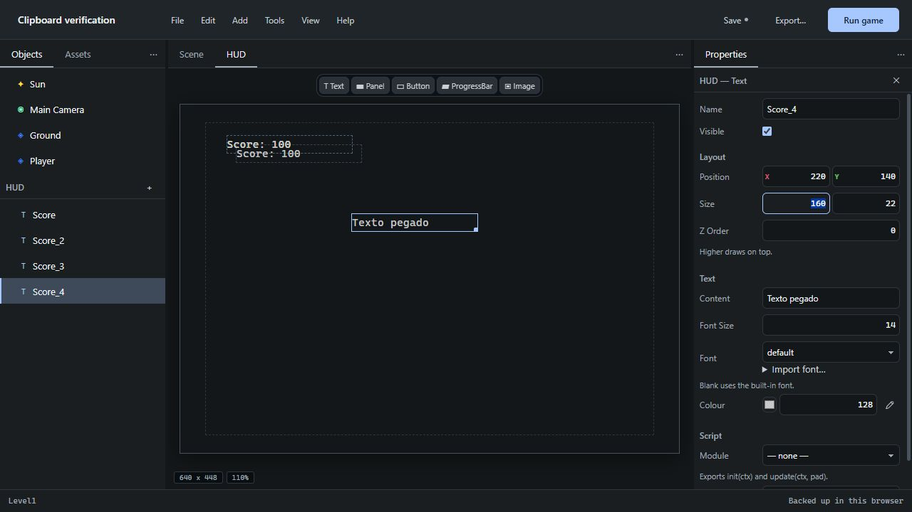
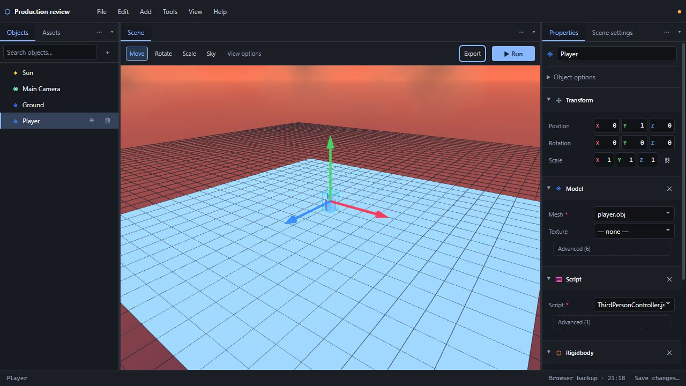
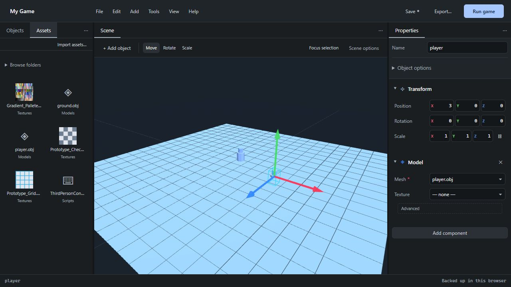
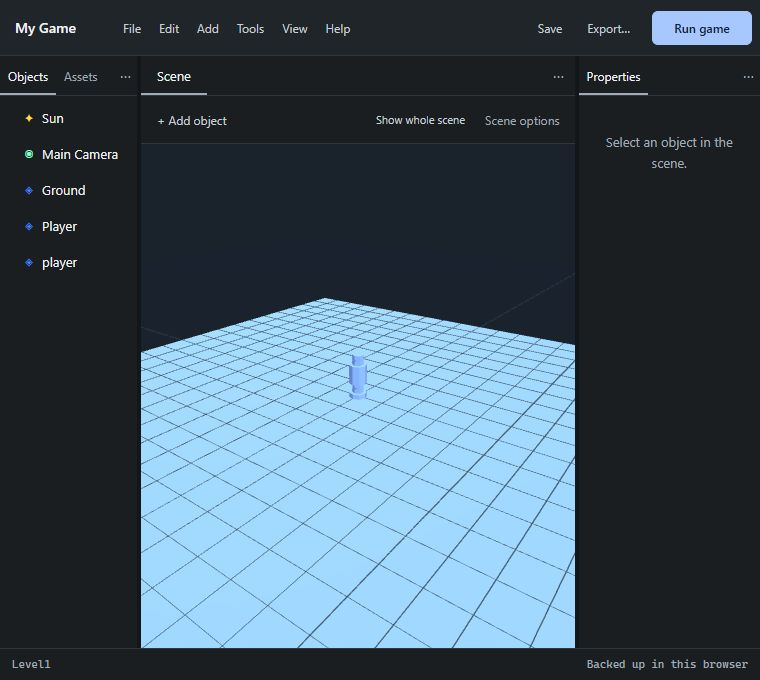
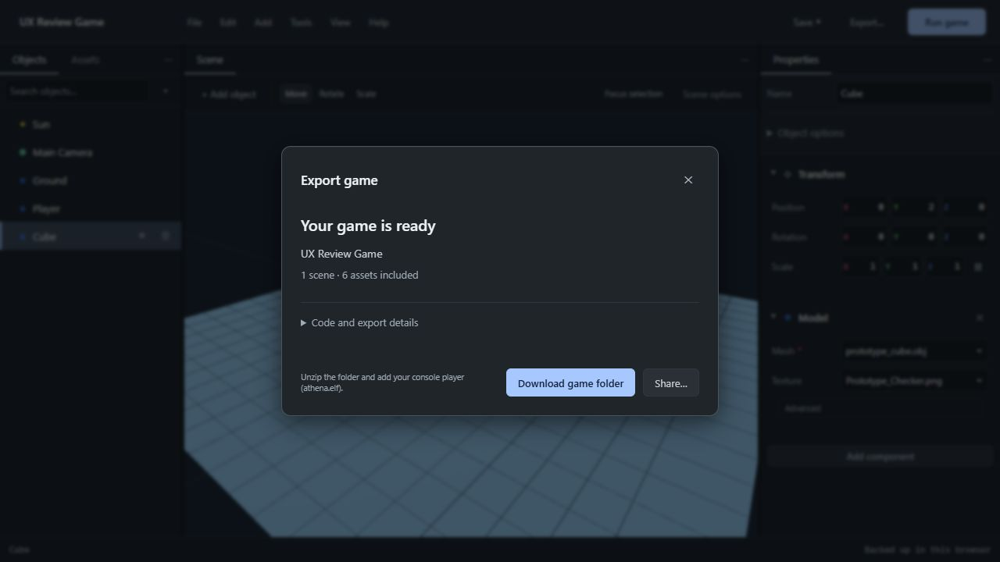

# Production review — 2026-10-02

The standalone editor is built from the committed source; index.html is synchronized
with that build. The current UX review used Deno 2.9.2 and a Chromium browser, including
Run/Stop through the local PCSX2 launcher. The baseline was bdb36e2; the existing
playable-start and focused-workspace redesign was reviewed and extended.
The console execution fixtures below were recorded on October 1 with PCSX2 2.6.3
and the bundled AthenaEnv player; those longer fixtures were not rerun for the UX changes.

## Clipboard and rendering corrections — October 2

The bundled player was updated to the official August 1 `latest` release; the
downloaded archive matched GitHub's SHA-256 digest. The extracted ELF hash and
release commit are recorded in [the runtime reference](../reference/AthenaEnvReleaseAndExamples/README.md).
Run uses that ELF unless a custom runtime has been selected.

- Ctrl+V invokes the clipboard reader during the keyboard gesture, with a fallback
  to the editor's last copy when access is denied. Native paste cancels a pending
  read to prevent duplicate imports. A delayed read cannot paste into another scene.
- All five HUD element types support Copy, Paste and Duplicate, independent values,
  unique IDs/names/script context keys, referenced image/font/script assets and one-step undo.
  Native Copy/Paste also works in detached panels; inputs retain normal text editing.
- NEAREST is assigned after all RenderData constructors, which otherwise reset shared
  Images to LINEAR. Embedded images are all updated. Terrain preview reacts to filter,
  shading, pipeline and texture-mapping changes without requiring another paint stroke.
- Gouraud and Flat emit numeric GS IIP values 1 and 0. The released Render module does
  not expose the SHADE constants previously used; undefined was silently interpreted as Flat.
- The sky masks writes to the main depth buffer, uses DEPTH_ALWAYS, then restores
  normal writes before geometry. Sky and live shadows share one buffer initialization.
  CT16S + Z16S remains available with its original VRAM footprint.

The eight supplied PCSX2 dumps had the same access violation at GSRendererHW::Draw
while resizing a target (official 2.6.3 symbols, GSRendererHW.cpp:4387). A private copy
of the staged game corresponding to a dump reproduced the crash with both the old and
latest Athena ELF. Disabling the sky avoided it; masking its depth writes fixed it.
Raw dumps and the user's staged game remain private and are not included in the repository.

Final PCSX2 2.6.3 hardware-renderer checks each reached **600 frames** and remained
running until the test stopped its own process:

| Execution | Color / depth | Result |
| --- | --- | --- |
| Copy of the supplied failing scene, corrected sky pass | CT16S / Z16S | Passed |
| Fresh side-scroller with desert sky, current generator | CT16S / Z16S | Passed |
| Sphere, terrain, desert sky and live shadow, current generator | CT16S / Z16S | Passed |
| Same combined scene, control format | CT32 / Z32 | Passed |

Runtime probes also confirmed sphere/terrain Image.filter = 0 (NEAREST), Gouraud = 1
and Flat = 0. Earlier comparison probes reproduced Flat = 0 for both old SHADE constant
assignments. These are emulator checks; real PS2 hardware was not tested.

Browser checks verified HUD menu Copy, Ctrl+D, consecutive Ctrl+V without extra copies,
and Ctrl+V within a text property without creating HUD elements. No console warnings/errors.
The actual keyboard and native Copy handlers are also exercised in the regression suite.

## Changes verified

- A third-person game is the initial project; alternate starting points are optional.
  Name/Enter, busy state and cancellation preserve a predictable creation flow.
- New projects enter Focus even after a customized layout. Selection reveals Properties;
  object/HUD creation uses a scoped picker, with seven common objects shown first.
- Save and Export remain available across tools; Run is primary in the local installation,
  while Export is primary on the hosted site and standalone file. Scene transforms require a selection;
  scene options and less common properties appear when requested or needed for an error.
- Property search follows the selection, mixed values are explicit, and changing one axis
  in a multi-selection preserves each object's other axes. Panel tabs support keyboard navigation.
- Export shows readiness and contents before code details. Copy appears with the code;
  Save and continue preserves the pending replacement if saving is cancelled or fails.
- First-run welcome and Focus workspace; contextual properties and advanced controls.
- Portable Save includes imported binaries and scripts. Disk backups yield to refreshed
  files; deliberate editor working copies retain precedence.
- New project cancellation preserves unsaved objects and undo history. All project
  replacement paths use the existing protection.
- Export boots the start scene and includes every executable level in ZIP, linked-folder
  writes and Run staging. Run can start the open scene independently.
- Named scene exits queue their destination and reload at the next frame boundary.
  Generated modules finish evaluating before the engine destroys their interpreter.
- Missing assets/scripts, invalid exits, ambiguous basenames, unsafe filenames and external
  glTF dependencies are actionable errors that prevent a misleading successful export.
- Unattached helper scripts are bundled with the game, including modules needed by behaviours.
- Namespace imports support behaviours defining init, update or both.
- Export diagnostics identify the scene and can reveal an object/HUD element in another level.
- Keyboard-operable menus and sections, named input axes, dialog focus restoration and
  reduced-motion support.
- Build replacement is atomic. Test staging refuses to replace directories it does not own.
- CI rebuilds and tests before Pages deployment; its public artifact contains only the editor.
- Assets starts with all files, including subfolders; folder filtering is optional and
  search spans the library. Selecting a file retains a relevant filter.
- Add a model chooses a real asset or imports and places one in one undo step. Cancellation,
  invalid OBJ input, retry and an import finishing in another project/scene are handled.
- Models can be dragged to visible scene surfaces, with ground fallback, base compensation
  and the current snapping setting. Undo removes the placement and its transformation tools.
- Menus close outside their task; Escape restores focus. Keyboard navigation and dialog
  focus exclude controls inside closed disclosures, even when the browser reports their rectangles.
- Small object/asset lists omit search. Duplicate empty-state actions and hidden-button
  space were removed. Narrow panels retain readable object names and tab labels.
- Download fallback status distinguishes the request from an actual saved file. Web Run
  opens useful local-installation guidance with a direct Export action.

## Automated suite

`deno task check`: **538 passed, 0 failed**. The suite covers project migration,
generation, hierarchy, physics/shadow math, viewport geometry/resources, fonts, terrain,
prefabs, assets, history, folder operations, project replacement, saves, launcher isolation
and exported bundles. The added UX tests cover creation, dialog focus, cancellation,
scoped object/HUD choices, contextual actions, selection and shared properties. New
regressions cover library navigation, import/placement history, scene drop positions,
transient popovers, web Run and download status. Editor
callback tests execute the actual command handlers; they do not emulate React effects
or native picker dialogs.

## Browser checks

Verified first run and name/Enter creation; existing playable-start and Focus layout;
model chooser cancellation, invalid OBJ import followed by a successful retry, immediate
selection/properties and one-step undo; dragging an existing model onto the ground and
undoing it; numeric editing; Scene options; File-menu arrows/Home/End and Escape focus
restoration; local Run/Stop; export readiness with details collapsed. The service-free
version was checked separately: Export is primary, F5 opens Run on your computer and its
Export action reaches a ready export. No local-launch request or configuration form appears.

The workspace was checked at 1280×720, 1024×768 and 760×680. A final CSS pass removed
hidden-button space and confirmed readable object names/tabs in the narrow view. Final
local and service-free sessions: **0 warnings/errors**. The full suite passed before
this last CSS-only pass; the final standalone build was rebuilt afterwards.

Browser backup recovery and the other production behaviours above also retain their
October 1 evidence and automated coverage. Earlier October 2 checks also covered
replacement cancellation, active-camera editing and Sky beside the scene. Workspace,
library, responsive and export screenshots below show this final build; sky.jpg records
the earlier October 2 review of the unchanged sky interface.

The embedded browser did not expose the export download event. The ZIP's actual byte
structure, scene entries and payloads are covered separately by automated tests. Native
file/folder dialogs were not automated; the logic after picker selection and cancelled
saves is covered by tests.

## Actual console-player execution

The following October 1 fixtures remain relevant because this redesign did not change
the generated game loop, controller templates or console engine.

`deno run -A tools/verify-templates.js` launched each generated game through the same
isolated launcher as Run. All **four controller templates passed** settling/gravity,
camera position and right/forward input assertions. Side Scroller also kept depth fixed.
The full numeric readbacks are in [templates.json](verification/templates.json).

`deno run -A tools/verify-levels.js` recorded **ten alternating level entries**,
First → Second → First → Second, with no captured startup error. This is an execution
test of the shipped player, not only a string comparison of generated code.
Readbacks are in [levels.json](verification/levels.json).

The old top-level infinite loop hung during reload because its module was still evaluating.
Screen.display now registers a frame callback after evaluation; the engine performs the
clear and presentation itself. There is no second Screen.flip in the generated callback.

## Scope and remaining limits

Real PS2 hardware was not available for this review. The browser preview is a scene editor,
not a PS2 renderer; emulator checks do not certify every combination of models, textures,
sound, animation or arbitrary user scripts. Assets are identified by filename in their
category; nested external model dependency layouts are not preserved. Use self-contained
GLB and flat script/module filenames for portable exports.

Browser recovery copies and linked-folder permissions belong to their origin/profile.
Imported folder bytes become portable when saved to a file; a recovery copy alone should
not be treated as a complete backup of external files. Specialized future work in ROADMAP
is historical planning, not a claim that every proposed capability ships in this release.

See the [nine-section design review and all 24 guide steps](UX-REVIEW.md).
The deployment uses the documented [GitHub Pages action](https://github.com/actions/deploy-pages)
and [Deno setup workflow](https://docs.deno.com/examples/deno_github_actions_tutorial/).
