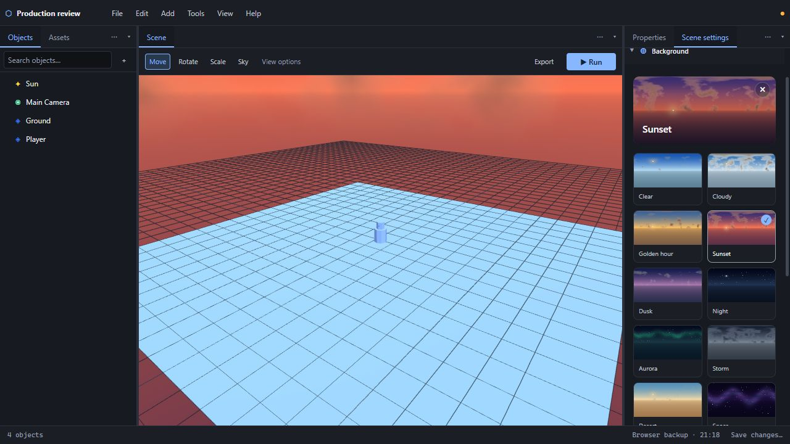

# Production review — 2026-10-01

The standalone editor is built from the committed source. The local review used
Deno 2.9.2, a Chromium browser and PCSX2 2.6.3 with the bundled AthenaEnv player.

## Changes verified

- First-run welcome and Focus workspace; contextual properties and advanced controls.
- Portable Save includes imported binaries and scripts. Disk backups yield to refreshed
  files; deliberate editor working copies retain precedence.
- New project cancellation preserves unsaved objects and undo history. All project
  replacement paths use the existing protection.
- Export boots the start scene and includes every executable level in ZIP, linked-folder
  writes and Run staging. Run can start the open scene independently.
- Named scene exits queue their destination and reload at the next frame boundary.
  Generated modules finish evaluating before the engine destroys their interpreter.
- Missing assets/scripts, invalid exits, ambiguous basenames, unsafe filenames and external
  glTF dependencies are actionable errors that prevent a misleading successful export.
- Unattached helper scripts are bundled with the game, including modules needed by behaviours.
- Namespace imports support behaviours defining init, update or both.
- Export diagnostics identify the scene and can reveal an object/HUD element in another level.
- Keyboard-operable menus and sections, named input axes, dialog focus restoration and
  reduced-motion support.
- Build replacement is atomic. Test staging refuses to replace directories it does not own.
- CI rebuilds and tests before Pages deployment; its public artifact contains only the editor.

## Automated suite

`deno task check`: **497 passed, 0 failed**. The suite covers project migration,
generation, hierarchy, physics/shadow math, viewport geometry/resources, fonts, terrain,
prefabs, assets, history, folder operations, project replacement, saves, launcher isolation
and exported bundles. Editor callback tests execute the actual command handlers; they do
not emulate React effects or native picker dialogs.

## Browser checks

Verified first run, project creation with name/Enter and a playable template, restoring the
browser backup, Focus layout, input labels, numeric edits and undo, keyboard opening a menu,
Sky while retaining the scene, Run/Stop, export summary/details and Escape restoring focus.
Final session console: **0 warnings/errors**.

The embedded browser did not expose the export download event. The ZIP's actual byte
structure, scene entries and payloads are covered separately by automated tests. Native
file/folder dialogs were not automated; the logic after picker selection and cancelled
saves is covered by tests.

## Actual console-player execution

`deno run -A tools/verify-templates.js` launched each generated game through the same
isolated launcher as Run. All **four controller templates passed** settling/gravity,
camera position and right/forward input assertions. Side Scroller also kept depth fixed.
The full numeric readbacks are in [templates.json](verification/templates.json).

`deno run -A tools/verify-levels.js` recorded **ten alternating level entries**,
First → Second → First → Second, with no captured startup error. This is an execution
test of the shipped player, not only a string comparison of generated code.
Readbacks are in [levels.json](verification/levels.json).

The old top-level infinite loop hung during reload because its module was still evaluating.
Screen.display now registers a frame callback after evaluation; the engine performs the
clear and presentation itself. There is no second Screen.flip in the generated callback.

## Scope and remaining limits

Real PS2 hardware was not available for this review. The browser preview is a scene editor,
not a PS2 renderer; emulator checks do not certify every combination of models, textures,
sound, animation or arbitrary user scripts. Assets are identified by filename in their
category; nested external model dependency layouts are not preserved. Use self-contained
GLB and flat script/module filenames for portable exports.

Browser recovery copies and linked-folder permissions belong to their origin/profile.
Imported folder bytes become portable when saved to a file; a recovery copy alone should
not be treated as a complete backup of external files. Specialized future work in ROADMAP
is historical planning, not a claim that every proposed capability ships in this release.

See the [nine-section design review and all 24 guide steps](UX-REVIEW.md).
The deployment uses the documented [GitHub Pages action](https://github.com/actions/deploy-pages)
and [Deno setup workflow](https://docs.deno.com/examples/deno_github_actions_tutorial/).
